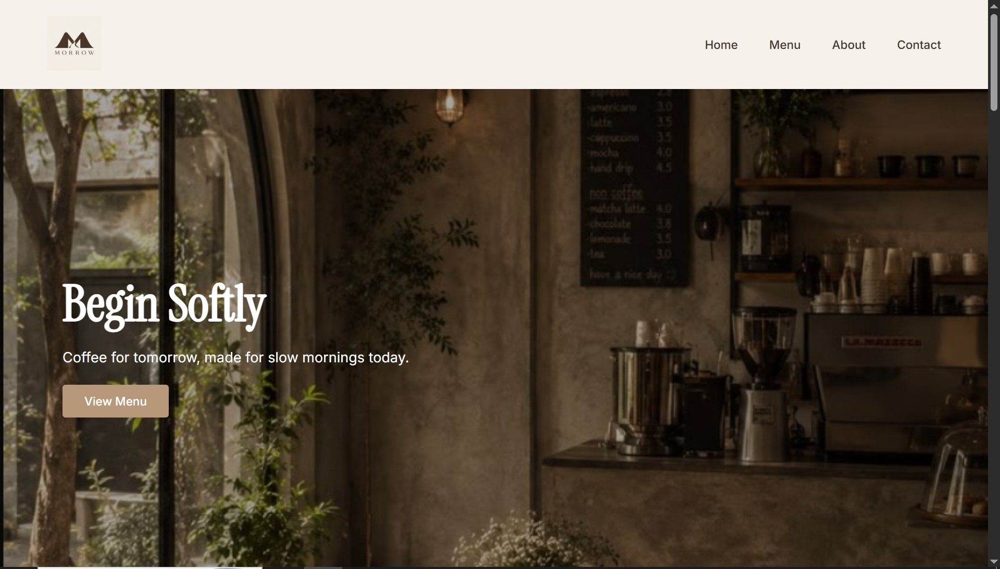

# ☕ Morrow Cafe — Landing Page

A responsive-in-progress cafe landing page built with HTML & CSS, featuring a custom brand identity I designed for a fictional cafe called **Morrow**.

## 🎨 About the Project

This project was built as part of my frontend development practice ladder, focused on strengthening core HTML/CSS skills — particularly Flexbox and CSS Grid — while working from a real, self-made brand identity (logo, color palette, typography, and moodboard) instead of a generic template.

## ✨ Sections

- Navbar
- Hero section
- About
- Menu (card grid)
- Featured items
- Opening hours
- Location & contact
- Footer

## 🛠️ Built With

- HTML5
- CSS3 (Flexbox, CSS Grid, custom properties/variables)

## 📚 What I Practiced

- Flexbox for layout (rows, columns, spacing)
- CSS Grid for card-based sections
- CSS variables for a consistent design system
- Working from real brand guidelines (colors, fonts, imagery)
- Git & GitHub basics (init, commit, push)

## 🚧 Next Steps

- Add responsive design (media queries) for mobile/tablet — planned as a dedicated follow-up focus
- Possibly add a mobile navbar (hamburger menu)

## 🔗 Live Preview

*(Add a GitHub Pages link here if you deploy it later)*
